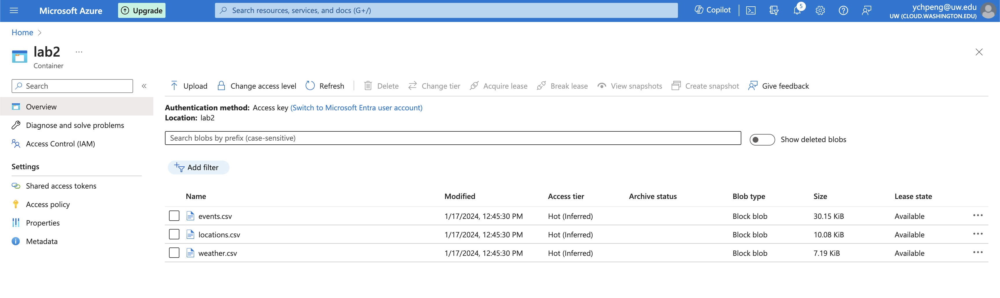

# TECHIN 510 Lab 2
Collect recent events data from https://visitseattle.org/ using Python scraper, get latitude and longitude coordinate data using API from https://nominatim.openstreetmap.org/ui/search.html, and finally use the coordinate data to get weather forecast on the day of event using the API provided by https://www.weather.gov/.

## Getting Started
Open the terminal and run the following commands:

```
python -m venv venv
source venv/bin/activate
pip install -r requirements.txt
```

## What's Included
- `lab2.ipynb`: The main Python script that does all the tasks described above.
- `lab2.py`: The Python script deployed on Github Actions.
- `events.csv`: All available events data from https://visitseattle.org/.
- `locations.csv`: Location data (in latitude and longitude) of the place where the event takes place.
- `weather.cvs`: Weather data of certain events (on the event day, at the location of events)

## Decisions in Data Collection
- To get the correct latitude and longitude data for events, this script tries to get the data via API using both the location (specific) and region (general) data, and also provides locations for some common places in Seattle that cannot/is difficult be searched via the API.
- For the weather API, I used the forecast property (details in https://www.weather.gov/documentation/services-web-api)
    - _forecast_ - forecast for 12h periods over the next seven days
    - _forecastHourly_ - forecast for hourly periods over the next seven days
    - _forecastGridData_ - raw forecast data over the next seven days
- The forecast property returns the weather data in two time sessions (12h as a period), and I'm only interested in the daytime session (e.g. for Wednesdays, the API will return weather data for "Wednesday" and "Wednesday night", and only the weather data for "Wednesdays" is collected).
- There are many detailed weather attributes in the json data returned from the API, and I'm only interested in the "detailedForecast" attribute.
    - e.g. "Rain before 1pm, then rain and snow likely between 1pm and 4pm, then rain and snow. Cloudy. High near 40, with temperatures falling to around 38 in the afternoon. South wind 3 to 7 mph. Chance of precipitation is 100%. New rainfall amounts between a tenth and quarter of an inch possible."

## Bonus
- Stored the csv data in Azure Blob.

    - `events.csv`: https://techin510.blob.core.windows.net/lab2/events.csv 
    - `locations.csv`: https://techin510.blob.core.windows.net/lab2/locations.csv 
    - `weather.csv`: https://techin510.blob.core.windows.net/lab2/weather.csv 
- 


## Lessons Learned
- The difference between scraper and APIs and learned to use both of them in one single project.
    - Learned how to use Python `request` and `beautifulsoup`.
- Learned the basics on HTML structures and how to use the inspection tool from Chrome to copy the selector for elements.
    - Also learned how to modify the selector path to select similar items from the same list but not THE specific item that we inspect (usually delete `div:nth-child(n)` and the path before).

## Questions / Uncertainties
- For sites that require login action (e.g. Weibo) to access contents, how can we use Python to scrape data? 
